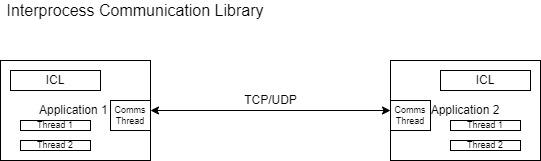

# Interprocessing Communication Library (ICL)

The idea is that every process has to have one thread just for communication and all the threads can communicate with threads of another processes by sending an async message to them via the the native communication thread.   
## Overview
[Project Overview](https://github.com/cu-ecen-aeld/final-project-sankalp123321/wiki/Project-Overview)  

## Timeline
[Project Schedule](https://github.com/cu-ecen-aeld/final-project-sankalp123321/wiki/Final-Project-Assignment-Schedule-Page-Template)  

## Team Members
1. Sankalp Agrawal
